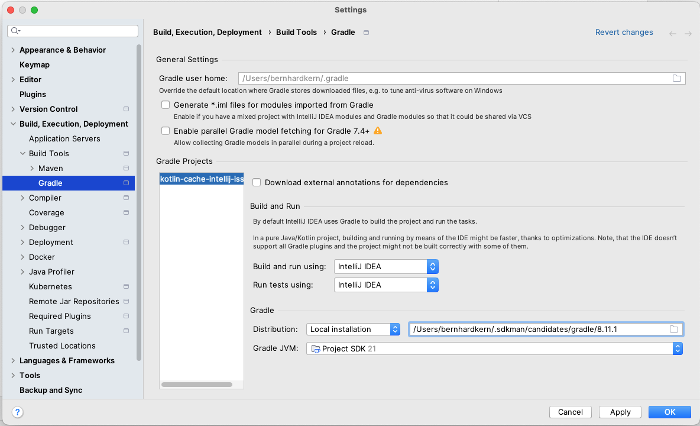

= kotlin compilation issue without k2 enabled

This project describes a compilation issue of a Kotlin / Gradle / Spring Boot project when using constants in companion objects in main, that are referred by tests.

The issue did not appear when using 2024.2.x, it is a new issue in 2024.3.1 or 2024.3 (not sure about 2024.3)

== To reproduce the issue:

Set your gradle settings to compile and run tests using IntelliJ

* Run the tests in `de.kern.kotlincacheintellijissue.SubjectUnderTestTest`
* Change the value of `de.kern.kotlincacheintellijissue.TestConstants.TEST_STRING_IN_COMPANION_OBJECT_OF_CLASS` to `test2`
* Rerun the test using Intellij
* Issue: Test stays green
* Expected: Test is red

After deleting the `out` folder and rerunning the test, it will fail.

Doing the same with a toplevel constant like `de.kern.kotlincacheintellijissue.TestConstantsKt.TEST_STRING_PUBLIC` does not produce the same issue, it works as expected.

https://youtrack.jetbrains.com/issue/IDEA-364577/Kotlin-does-not-recompile-correctly-when-referencing-companion-object-constant-in-module-main-from-module-test-without-k2-active[Link to Jetbrains Youtrack]
